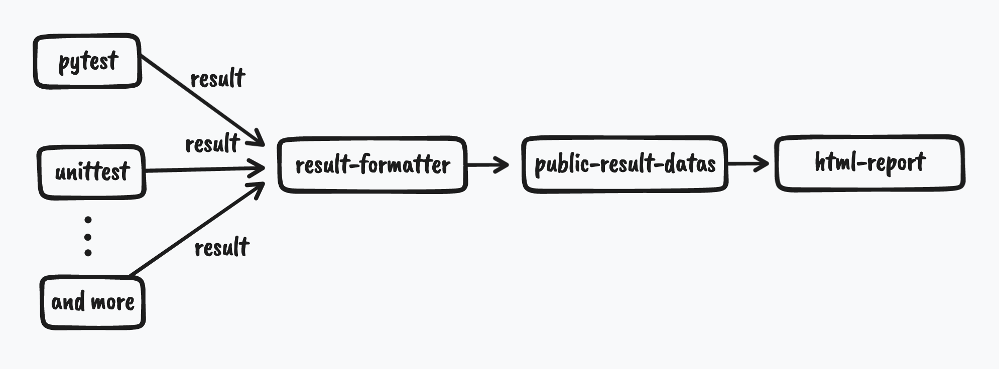

# PyWebReport

Generate html reports by sources such as unittest、pytest and any more  

like allure but as do-one-thing-do-it-well for **python community**.  

## Current progress

- [x] Feasibility Study.(it seems feasible)  
- [ ] Report designing 🚧👷(you can see progress [here](https://yongchin0821.github.io/pywebreport/))  
- [x] pytest adaptation  
- [x] unittest adaptation  

## My initial idea

We may extract results in different formats from pytest、unittest. if there have a formatter to format results into the  
common datas,then we can use this datas to make html report.  

  

## Installation

```
# pip install pywebreport
```

or you can clone this rep, and run the command to install

```
# python setup.py install
```

## Usage

### pytest

just run the command

```shell
# pytest -q --report result/report.html
```

or in **.py** you can run script like:

```python
import pytest

if __name__ == '__main__':
    args = ['./', '-q', '--report', 'result/report.html']
    pytest.main(args)
```

### unitest

**import the WebReportRunner**, and just give the TestSuite to WebReportRunner  
no matter how TestSuite is collected  
**just give the suites to WebReportRunner**  

like this:

```python
import unittest
from test_success import UnitTestSuccessCase
from pywebreport import WebReportRunner


if __name__ == '__main__':
    suite = unittest.TestSuite()
    loader = unittest.TestLoader()

    # suite.addTest(UnitTestSuccessCase("test_case2"))
    # suite.addTest(UnitTestSuccessCase("test_err_print"))
    # suite.addTest(loader.loadTestsFromTestCase(UnitTestCase))
    # suite = loader.loadTestsFromTestCase(UnitTestCase)

    suite.addTest(loader.discover("."))

    runner = WebReportRunner(report="result/report.html")
    test_result = runner.run(suite)
```

### other

No matter what testing framework you use, just give the formatted result datas like this:

```json
{
  "title": "PyWebReport",
  "path": "/Users/yongchin/someplace/pytest/result/report.html",
  "result": {
    "total": "8",
    "passed": "4",
    "failed": "3",
    "warnings": "1",
    "error": "1",
    "skipped": "1",
    "duration": "0.09765386581420898",
    "deselected": "0",
    "rate_passed": "50.00%",
    "rate_failed": "37.50%",
    "rate_warnings": "12.50%",
    "rate_skipped": "12.50%"
  },
  "suites": {
    "test/testsuites/pytest/test_fail.py": {
      "cases": {
        "test_case1": {
          "id": "test/testsuites/pytest/test_fail.py::test_case1",
          "desc": "test fail",
          "status": "failed",
          "duration": 0.0,
          "className": "",
          "consoleLog": [],
          "errMsg": "def test_case1():\n        \"\"\"test fail\"\"\"\n>       assert 0\nE       assert 0\n\ntest_fail.py:10: AssertionError",
          "execTime": "2022-07-20 10:33:54"
        },
        "test_case2": {
          "id": "test/testsuites/pytest/test_fail.py::test_case2",
          "desc": "\u3053\u3093\u306b\u3061\u306f\u4e16\u754c",
          "status": "failed",
          "duration": 0.0,
          "className": "",
          "consoleLog": [],
          "errMsg": "def test_case2():\n        \"\"\"\u3053\u3093\u306b\u3061\u306f\u4e16\u754c\"\"\"\n>       raise IOError(123)\nE       OSError: 123\n\ntest_fail.py:15: OSError",
          "execTime": "2022-07-20 10:33:54"
        },
        "test_case3": {
          "id": "test/testsuites/pytest/test_fail.py::test_case3",
          "desc": "test error",
          "status": "failed",
          "duration": 0.0,
          "className": "",
          "consoleLog": [],
          "errMsg": "@pytest.fixture()\n    def user():\n        a = \"yoyo\"\n>       assert a == \"yoyo123\"  # fixture failed with error\nE       AssertionError: assert 'yoyo' == 'yoyo123'\nE         - yoyo123\nE         + yoyo\n\ntest_fail.py:21: AssertionError",
          "execTime": "2022-07-20 10:33:54"
        }
      },
      "results": {
        "counts": 3,
        "passed": 0,
        "failed": 3,
        "warnings": 0,
        "error": 0,
        "skipped": 0,
        "rate_passed": "0.00%"
      },
      "duration": 0.0
    },
    "test/testsuites/pytest/test_success.py": {
      "cases": {
        "test_case1": {
          "id": "test/testsuites/pytest/test_success.py::TestA::test_case1",
          "desc": "test pass",
          "status": "passed",
          "duration": 0.0,
          "className": "TestA",
          "consoleLog": [],
          "errMsg": "",
          "execTime": "2022-07-20 10:33:54"
        },
      },
      "results": {
        "counts": 5,
        "passed": 4,
        "failed": 0,
        "warnings": 0,
        "error": 0,
        "skipped": 1,
        "rate_passed": "80.00%"
      },
      "duration": 0.0
    }
  }
}
```

then, use the pywebreport's API, report will be generated

```python
from pywebreport import mkrepot

datas = {
  "title": "PyWebReport",
  "path": "report.html",
  "result": {...},
  "suites": {...}
}

mkrepot(datas)
```

## Recruitment

This is an incubation project  

hope and invite you to join me if you are interested in this project  

- [ ] a contributor who can design the report style  
- [ ] a contributor who is familiar with pytest\unittest
